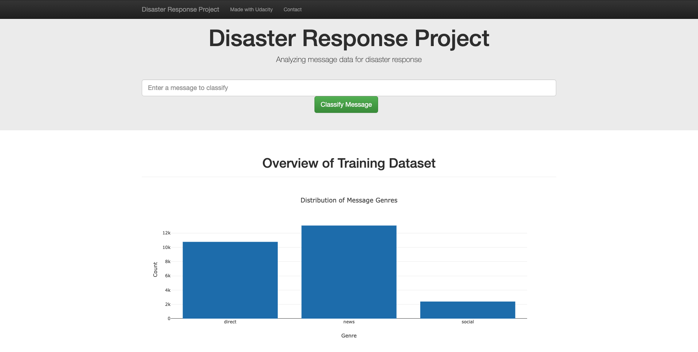
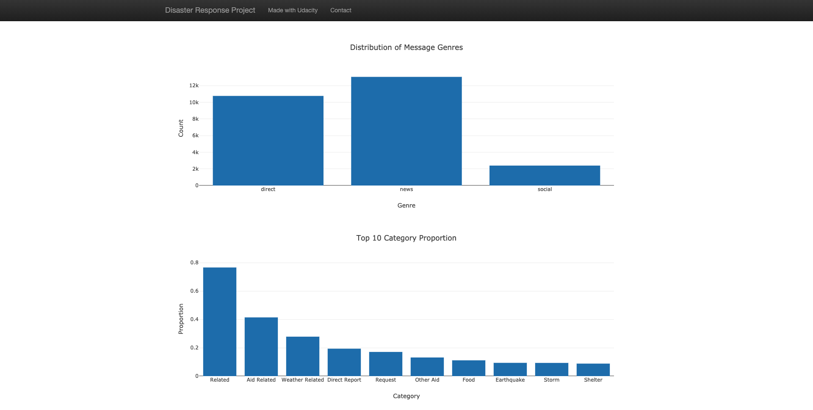
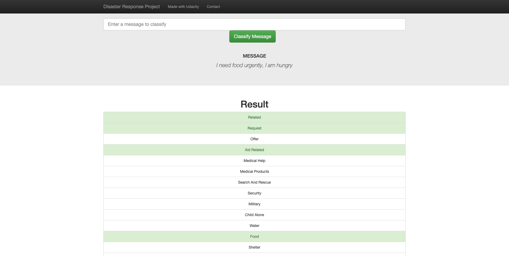

# Disaster Response Pipeline Project
In this project, you'll apply the data engineering skills to analyze disaster data from [Figure Eight](https://www.figure-eight.com/) to build a model for an API that classifies disaster messages. You'll find a data set containing real messages that were sent during disaster events. You will be creating a machine learning pipeline to categorize these events so that you can send the messages to an appropriate disaster relief agency.

The project includes well a web app where an emergency worker can input a new message and get classification results in several categories. The web app also displays visualizations of the data. 

## Project Components
There are three components you'll need to complete for this project.

**1. ETL Pipeline**
   
The python script, `process_data.py` file, contains the ETL pipeline, which:
- Loads the messages and categories datasets
- Merges the two datasets
- Cleans the data
- Stores it in a SQLite database
  
**2. ML Pipeline**

The python script, `train_classifier.py` file, contains the ML pipeline, which:
- Loads data from the SQLite database
- Splits the dataset into training and test sets
- Builds a text processing and machine learning pipeline
- Trains and tunes a model using GridSearchCV
- Outputs results on the test set
- Exports the final model as a pickle file
  
**3. Flask Web App**

The web app allows the user to input a disaster message, and then display the categories of the message. Also, the app shows some visualizations about the data.


## Installation
This project requires **Python 3.x** version. And in order to complete this project, you need to install the following libraries:
- [re](https://docs.python.org/3/library/re.html)
- [sys](https://docs.python.org/3/library/sys.html)
- [pickle](https://docs.python.org/3/library/pickle.html)
- [json](https://docs.python.org/3/library/json.html)
- [pandas](https://pandas.pydata.org/)
- [sklearn](https://scikit-learn.org/stable/)
- [nltk](https://www.nltk.org/)
- [sqlalchemy](https://www.sqlalchemy.org/)
- [flask](https://flask.palletsprojects.com/en/2.0.x/)
- [plotly](https://plotly.com/)


## File Structure
The project files are structured as the following:
```
- app
| - template
| |- master.html  # main page of web app
| |- go.html  # classification result page of web app
|- run.py  # Flask file that runs app

- data
|- disaster_categories.csv  # data to process 
|- disaster_messages.csv  # data to process
|- process_data.py
|- DisasterResponse.db   # database to save clean data to

- models
|- train_classifier.py
|- classifier.pkl  # saved model 

- README.md
```

## Instructions
To execute the project, you need to run the following commands:
1. Run the following commands in the project's root directory to set up your database and model.

    - To run ETL pipeline that cleans data and stores in database:
        
        `python data/process_data.py data/disaster_messages.csv data/disaster_categories.csv data/DisasterResponse.db`
    - To run ML pipeline that trains classifier and saves:
        
        `python models/train_classifier.py data/DisasterResponse.db models/classifier.pkl`

2. Run the following command in the app's directory to run your web app:
    
    `python run.py`

3. Go to http://0.0.0.0:3001/

## Web App Screenshots
- **Web App Overview**
  
  

- **Visualizations**

    

- **Message Classification Example**
  
  
  